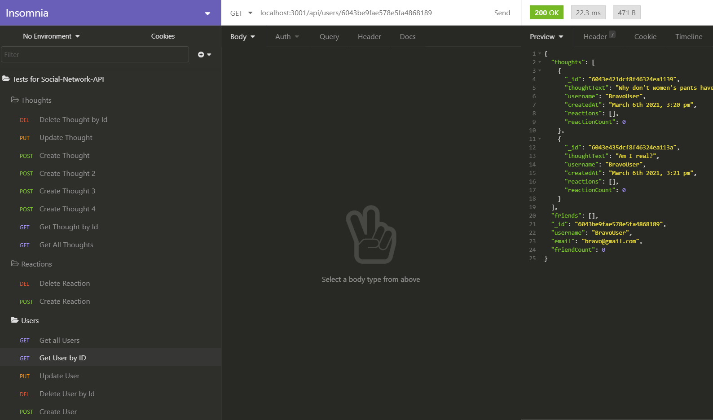
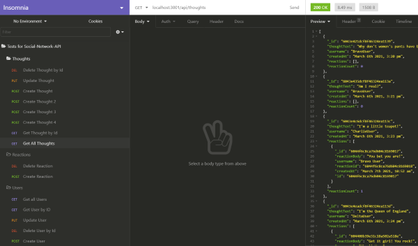

# Social-Network-API   

**Video Walkthrough:**

[Part # 1 User CRUD routes, Thoughts CREATE route](https://drive.google.com/file/d/1KEHk0f5oW_MUx39kzipSBscAg5skVEy9/view?usp=sharing)

[Part # 2 Thought RUD routes, ADD/REMOVE Friend, CREATE Reaction](https://drive.google.com/file/d/1RRxm4TJESHYsfYH93PuYbJP6UUQU6Zwf/view?usp=sharing)

[Part # 3 DELETE reaction](https://drive.google.com/file/d/1hVTC9OeN8RWv_AZeJv70-7vipo9tQl8Y/view?usp=sharing)

## Acceptance Criteria

- GIVEN a social network API
- WHEN I enter the command to invoke the application
- THEN my server is started and the Mongoose models are synced to the MongoDB database
- WHEN I open API GET routes in Insomnia Core for users and thoughts
- THEN the data for each of these routes is displayed in a formatted JSON
- WHEN I test API POST, PUT, and DELETE routes in Insomnia Core
- THEN I am able to successfully create, update, and delete users and thoughts in my database
- WHEN I test API POST and DELETE routes in Insomnia Core
- THEN I am able to successfully create and delete reactions to thoughts and add and remove friends to a user’s friend list

## **Table of Contents**

* *[Installation](#installation)*
* *[Usage Instructions](#usage-instructions)*
* *[Contributing](#contributing)*
* *[Technology](#technology)*
* *[Tests](#tests)*
* *[Questions](#questions)*
* *[License](#license)*

## **Installation**

After cloning/forking the applications use the command `npm i` or `npm install` to download the necessary dependencies.

## **Usage-instructions**

This application does not have a front-end and as such the routes can be tested in 'Insomnia Core" or any other desktop API design editor of your choosing. 

## **Screenshots**

 

### USER routes:

 

GET all users: 

GET user by Id:

CREATE user:

UPDATE user: 

DELETE user:

---

 

### Thought routes:

 

GET all thoughts:

GET thought by Id:

UPDATE thought:

DELETE thought:

 

---

 

### Reaction routes:

 

CREATE reaction:

DELETE reaction: 

 

---

 

### Friend routes:

 

ADD friend:

Remove friend:

 

---

 

## **Contributing**

Please refer to the **[Contributor Covenant](https://www.contributor-covenant.org/)** for contribution guidelines.

## **Technology**

This project was completed using: 
- `Node.js`
- `Express`
- `Insomnia`
- `MongoDB`
- `Mongoose`
- `Moment.js`

## **Tests**  

No test need to be run at this time. 

## **Questions**

For any questions, comments, or feedback please feel free to reach out:  
- **[Github](https://github.com/gintstir)** 
- **<gint.stirbys@gmail.com>**

## **License** 

Copyright © Gintautas Stirbys, 2021.  All Rights Reserved.

This Project is licensed under the **[Apache~2.0](https://www.apache.org/licenses/LICENSE-2.0)** license.
